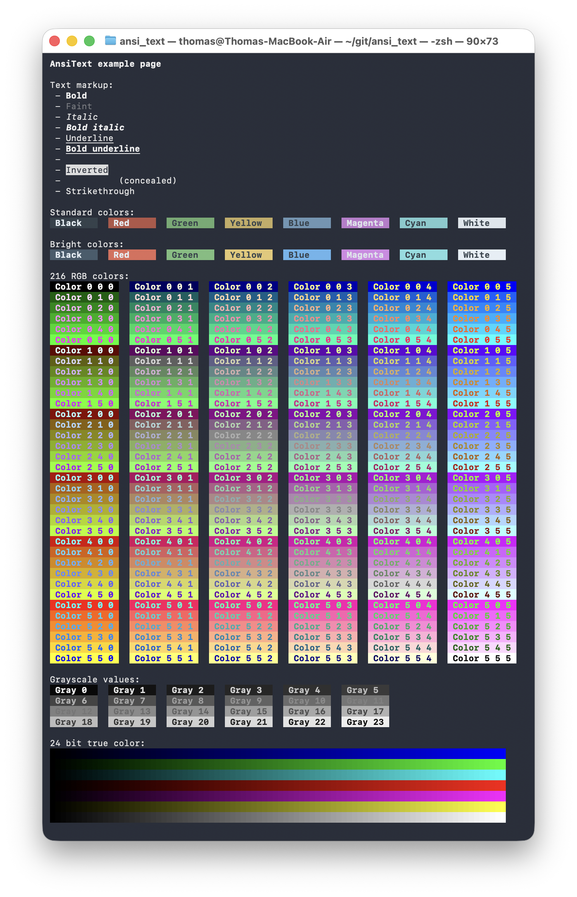

# ANSI Text
A library for styling and formatting terminal text using [ANSI escape codes](https://en.wikipedia.org/wiki/ANSI_escape_code#SGR),
specifically the Select Graphic Rendition (SGR) control sequences. Styles are declarative and structured to enable convenient IDE
auto-completion.

### Usage
To add ANSI styling to text, wrap the string in an `AnsiText` object:
```dart
final text = AnsiText('Hello, world');
```

The `AnsiText` object can now be formatted by applying styling to it:
```dart
text
  ..apply(Styles.markup.bold)
  ..apply(Styles.color.text.bright.yellow)
  ..apply(Styles.color.background.red);
```

The text can be output to the terminal by printing it or writing it to `stdout` or `stderr`. Printing automatically calls
`toString()` on the `AnsiText` object, applying all requested ANSI escape codes and appending a terminating reset sequence:

```dart
print(text);
```

When applying multiple style attributes to a single `AnsiText` object, the `applyAll` method can be convenient:
```dart
AnsiText('Hello, world')
..applyAll({
    Styles.markup.bold,
    Styles.color.text.bright.yellow,
    Styles.color.background.red,
});
```

Note that the `Styles` class is structured in such a way that it provides out-of-the-box command completion in an IDE, allowing for
fast entry and compile-time checking.

#### Shorthand methods
Various shorthand methods for frequently used styles are provided. For example, instead of typing:
```dart
text..apply(Styles.markup.bold);
```
one may also use:
```dart
text..bold();
```

See [shorthand.dart](lib/src/shorthand.dart) for the complete list of shorthand methods.

#### Color palettes
This library supports three color palettes:
1. The 8 standard colors + 8 brighter versions
2. The 256-color (8-bit) color system, extending the standard colors with 216 RGB colors and 24 grayscales
3. The 24-bit RGB true color palette, comprising of over 16 million colors

The standard colors are implemented as color names. The "bright" variants of the standard colors require a `bright.` prefix. For
example:

```dart
AnsiText('Hello, world')
  ..apply(Styles.color.text.yellow) // standard color
  ..apply(Styles.color.background.bright.red) // bright variant
```

The 216 RGB colors from the 8-bit color scheme are available through the `rgb(int red, int green, int blue)` method. The values of
each component must be between 0 and 5 (inclusive). For example:

```dart
AnsiText('Hello, world')
  ..apply(Styles.color.text.rgb(1, 2, 3))
  ..apply(Styles.color.background.rgb(3, 2, 1));
```

For grayscales there is the `gray(int lightness)` method. The value must be between 0 and 23 (inclusive), with 0 being the darkest
and 23 the lightest. Example:

```dart
AnsiText('Hello, world')
  ..apply(Styles.color.text.gray(3))
  ..apply(Styles.color.background.gray(18));
```

In order to output text or background in 24-bit true color, use the `trueColor(int red, int green, int blue)` method. The values of
each component must be between 0 and 255 (inclusive). Example:

```dart
AnsiText('Hello, world')
  ..apply(Styles.color.text.trueColor(60, 120, 180))
  ..apply(Styles.color.background.trueColor(180, 120, 60));
```

The library does not automatically detect terminal color support. Typically, terminals advertise support via the `TERM` and
`COLORTERM` environment variables. For example, `TERM=xterm-256color` indicates 256-color support, while `COLORTERM=truecolor`
indicates 24-bit true color support.

Similarly, there is no guarantee that all of the markup options work as expected. Not all terminal emulators support all of the
provided markup styles.

#### Global configuration
By default, `ansi_text` will always output ANSI escape codes, but there is an on/off switch should you wish to suppress the use of
markup and colors globally:

```dart
AnsiText.enabled = false; // suppress markup and colors
```

Setting `AnsiText.enabled` to false is useful in those cases where the output stream does not support ANSI markup. For the best user
experience, you can sync the library with the user's terminal capabilities using `dart:io`:

```dart
import 'dart:io';
import 'package:ansi_text/ansi_text.dart';

void main() {
  // Automatically disable colors if the terminal doesn't support them
  AnsiText.enabled = stdout.hasTerminal && stdout.supportsAnsiEscapes;
}
```

### Examples
See [example/example.dart](example/example.dart) for a reasonably exhaustive overview of colors and markup. Running it produces the
following output:


